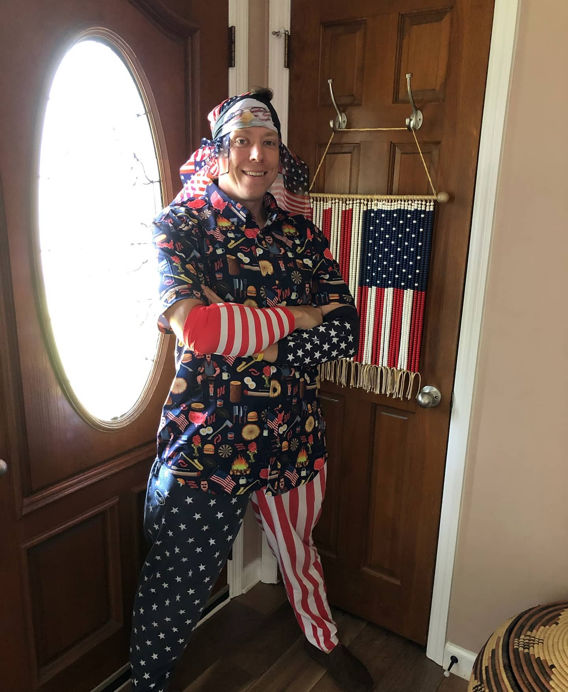

# Build Things Website Redesign Specification

## 1. Color Palette
```css
--color-primary: #E63946;     /* Bold Red */
--color-white: #F1FAEE;       /* Off-White */
--color-light-blue: #A8DADC;  /* Light Blue */
--color-blue: #457B9D;        /* Medium Blue */
--color-dark: #1D3557;        /* Dark Blue */
```

## 2. Typography
- **Primary Font (Headers)**: Montserrat
  - Bold (700) for main headlines
  - Semi-bold (600) for section headers
  - Regular (400) for navigation
- **Secondary Font (Body)**: Open Sans
  - Regular (400) for body text
  - Semi-bold (600) for emphasis
- **Font Sizes**:
  - H1: 2.5rem (40px)
  - H2: 2rem (32px)
  - H3: 1.5rem (24px)
  - Body: 1rem (16px)
  - Small: 0.875rem (14px)

## 3. Layout Improvements

### Navigation
- Fixed position header
- White background with subtle shadow
- Red accent for CTA button
- Light blue hover states
- Mobile-friendly hamburger menu

### Hero Section
- Reduced height (60vh max)
- Dark blue background with subtle red gradient
- White text for contrast
- Clear value proposition
- CTA button in red

### Founder Section
- Compact layout with 30% width for image
- Right-aligned text content
- Professional headshot style
- Light blue background
- Dark text for readability
- Maximum height constraint

### Content Sections
- Consistent padding (4rem top/bottom)
- Three-column grid for features
- Two-column grid for benefits
- Card-based layout with subtle shadows
- Red accents for important elements

### Cards & Components
- Rounded corners (8px)
- White background
- Subtle shadow on hover
- Red accent elements
- Light blue backgrounds for alternate sections

## 4. Specific Section Improvements

### About Section
```html
<section class="about">
  <div class="container">
    <div class="about-grid">
      <div class="about-content">
        <h2>Our Vision</h2>
        <p>[Vision content]</p>
      </div>
      <div class="about-metrics">
        <!-- Key metrics/numbers -->
      </div>
    </div>
  </div>
</section>
```

### Founder Section
```html
<section class="founder">
  <div class="container">
    <div class="founder-grid">
      <div class="founder-image">
        <!-- 30% width maximum -->
        
      </div>
      <div class="founder-content">
        <h2>Meet Our Founder</h2>
        <p>[Founder content]</p>
      </div>
    </div>
  </div>
</section>
```

## 5. Responsive Design Breakpoints
- Mobile: 320px - 480px
- Tablet: 481px - 768px
- Desktop: 769px - 1024px
- Large Desktop: 1025px+

## 6. Interactive Elements

### Buttons
- Primary (Red):
  - Background: #E63946
  - Text: White
  - Hover: Slightly darker with shadow
- Secondary (Blue):
  - Background: #457B9D
  - Text: White
  - Hover: Slightly darker

### Links
- Default: #457B9D
- Hover: #E63946
- Transition: 0.3s ease

### Cards
- Background: White
- Border: None
- Shadow: 0 2px 4px rgba(0,0,0,0.1)
- Hover: Slight lift effect

## 7. Performance Considerations
- Optimize images
- Lazy loading for below-fold content
- Minify CSS/JS
- Use CSS Grid and Flexbox for layouts
- Implement responsive images

## 8. Accessibility
- WCAG 2.1 AA compliance
- Proper contrast ratios
- Semantic HTML
- ARIA labels where needed
- Keyboard navigation support

## 9. Implementation Priority
1. Color scheme update
2. Typography system
3. Navigation redesign
4. Hero section
5. Founder section resize
6. Content sections
7. Responsive design
8. Interactive elements
9. Performance optimization
10. Accessibility implementation

## 10. Success Metrics
- Improved load time (<3s)
- Mobile-friendly score >90
- Accessibility score >90
- Clear visual hierarchy
- Consistent branding
- Professional appearance
